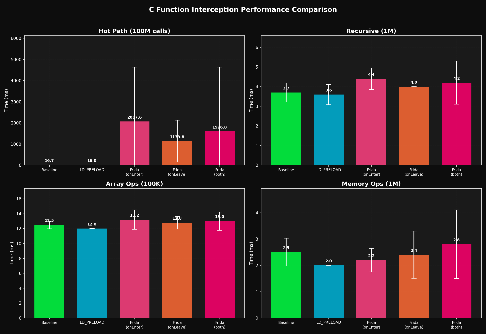
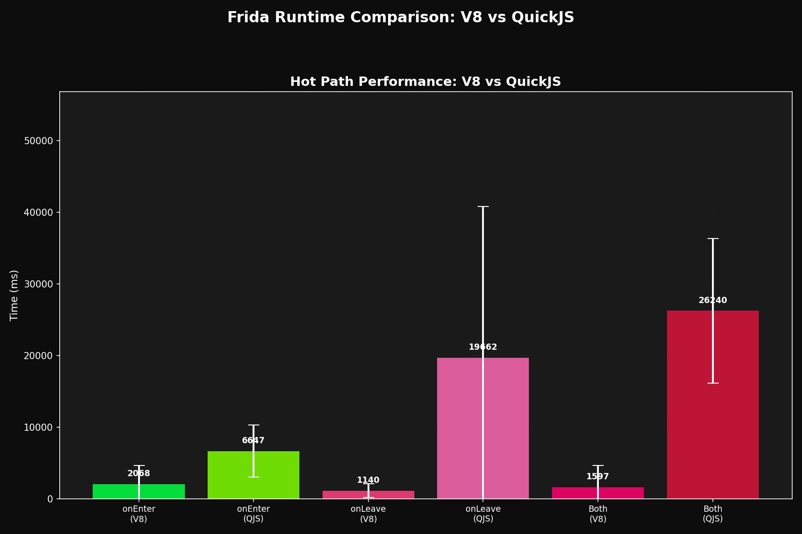

# C Function Interception Benchmarks

Compare LD_PRELOAD vs Frida overhead across different function types.

```bash
./run_all.sh
```

## Results





## Methods

**LD_PRELOAD**: Replace functions at load time
```bash
LD_PRELOAD=./hook.so ./benchmark
```

**Frida**: Inject hooks at runtime
```bash
frida -l frida_both.js ./benchmark
```