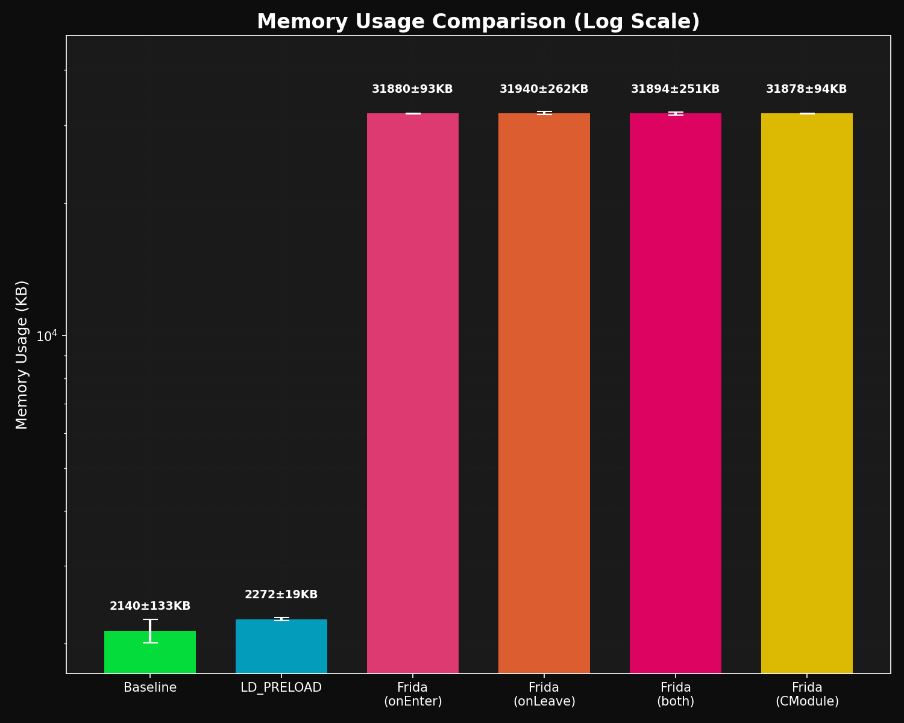

# C Function Interception Benchmarks

Compare LD_PRELOAD vs Frida overhead across different function types.

## Setup

Activate virtual environment and run benchmarks:
```bash
source .venv/bin/activate
./run_all.sh
```

## Environment

- **Frida version**: 17.2.17
- **CPU architecture**: x86_64

## Results

### Overall Performance Comparison

**Shows**: Execution time overhead across all function types (hot path, heavy work, recursive, array, memory operations) comparing baseline vs LD_PRELOAD vs Frida interception methods.

### Runtime Comparison (V8 vs QuickJS)

**Shows**: Performance difference between Frida's V8 and QuickJS JavaScript engines. V8 is the default Chrome/Node.js engine (faster), QuickJS is a lightweight alternative (smaller footprint).

### Function-Specific Analysis

#### Hot Path Functions

**Shows**: Overhead for frequently-called functions (1M calls). This simulates intercepting functions in tight loops or critical performance paths.

#### Heavy Work Functions

**Shows**: Impact on CPU-intensive functions (1M calls with computation). Tests whether interception overhead is noticeable when the function itself does significant work.

#### Recursive Functions

**Shows**: Overhead for recursive functions like factorial (1M calls of factorial(20)). Each recursive call triggers the hook, multiplying the interception cost.

#### Array Operations

**Shows**: Performance impact on functions that process arrays with pointer arithmetic (100K calls processing 1000-element arrays). Common in systems programming and data processing.

#### Memory Operations

**Shows**: Overhead for functions doing dynamic memory allocation/deallocation (1M calls allocating 1KB). Critical for understanding impact on memory-intensive applications.

#### Complex Path Performance

**Shows**: Performance for compute_sum_complex function (1M calls). Tests interception overhead on functions with more complex control flow.

### Memory Usage Analysis

**Shows**: RAM consumption comparison between methods. LD_PRELOAD has minimal memory overhead, while Frida requires a JavaScript VM runtime.

## Methods

**LD_PRELOAD**: Replace functions at load time
```bash
LD_PRELOAD=./hook.so ./benchmark
```

**Frida (JavaScript)**: Inject hooks at runtime with JavaScript callbacks
```bash
frida -l frida_both.js ./benchmark
```


## Statistical Analysis

- **Metric**: Median (robust to outliers)  
- **Error bars**: Interquartile range (Q1-Q3)
- **Timing**: Wall clock (`CLOCK_MONOTONIC`)
- **Validation**: Hook failure detection ensures reliable measurements

## Runtime Engines

- **V8**: Fast JavaScript engine (Chrome/Node.js)
- **QuickJS**: Lightweight JavaScript engine
- **Main comparison**: Uses V8 runtime for primary results
- **Runtime comparison**: Dedicated V8 vs QuickJS chart showing engine performance differences

## Key Findings

**Performance Impact**: The benchmarks show the overhead of different interception methods:
- **LD_PRELOAD**: Minimal overhead for function interception at load time
- **Frida JavaScript**: Higher overhead due to JavaScript VM context switches
- **V8 vs QuickJS**: V8 generally performs better than QuickJS for complex operations

**Call Frequencies**:
- **Hot path & Heavy work**: 1M calls each (compute_sum and compute_sum_heavy)
- **Recursive**: 1M calls to factorial(20) - each call internally makes 20 recursive calls
- **Array ops**: 100K calls processing 1000-element arrays
- **Memory ops**: 1M calls allocating/freeing 1KB
- **Complex path**: 1M calls to compute_sum_complex

## Support

If you find this project useful, consider supporting development:

[](https://ko-fi.com/f0rw4rd)
